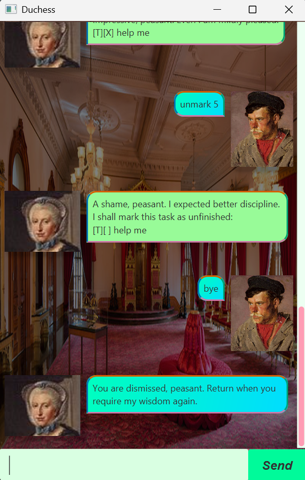

# Duchess User Guide



Duchess is a personal task management chatbot that helps you keep track of todo, deadline, and event tasks.
You can interact with Duchess using simple text commands in the GUI.

> [!NOTE]
> 
> - Words in UPPER_CASE are parameters you supply, e.g., todo \<DESCRIPTION>
> 
> - Date/time formats:
>   - Deadlines: yyyy-MM-dd
>   - Events: yyyy-MM-dd HHmm
> 
> - Task numbers refer to the number shown in the `list` command
> 
> - Extraneous or invalid input will trigger error messages from Duchess

## Adding todos

You can add a todo task with a description.

Command: `todo <TASK_DESCRIPTION>`

Example: `todo submit report`

```
As you command, peasant. I have inscribed this task into the royal ledger:
[T][ ] submit report
You now possess 1 obligation under my watch.
```

## Adding deadlines

You can add a deadline task with a description and a due date.

Command: `deadline <TASK_DESCRIPTION> /by <yyyy-MM-dd>`

Example: `deadline submit report /by 2026-02-20`

```
As you command, peasant. I have inscribed this task into the royal ledger:
[D][ ] submit report (by: Feb 20 2026)
You now possess 2 obligations under my watch.
```
> [!TIP]
>
> Make sure to follow the yyyy-MM-dd format exactly, or Duchess will reject the task.

## Adding events

You can add an event task with a description, a start time and an end time.

Command: `event <TASK_DESCRIPTION> /from <yyyy-MM-dd HHmm> /to <yyyy-MM-dd HHmm>`

Example: `event submit report /from 2026-02-20 1800 /to 2026-02-20 2000`

```
As you command, peasant. I have inscribed this task into the royal ledger:
[E][ ] submit report (from: Feb 20 2026, 6 pm
to: Feb 20 2026, 8 pm)
You now possess 3 obligations under my watch.
```
### Tip:
- Make sure to follow the yyyy-MM-dd HHmm format exactly, or Duchess will reject the task.

## Listing tasks

You can see all the tasks currently in your royal ledger.

Command: `list`

```
Very well. Behold your royal obligations, peasant:
1.[T][ ] submit report
2.[D][ ] submit report (by: Feb 20 2026)
3.[E][ ] submit report (from: Feb 20 2026, 6 pm to: Feb 20 2026, 8 pm)
```

## Marking tasks as done

You can mark a task as completed to show it’s been conquered.

Command: `mark <TASK_NUMBER>`

Example: `mark 2`

```
Impressive, peasant. Even I am mildly pleased.
[D][X] submit report (by: Feb 20 2026)
```

## Unmarking tasks

You can undo a completed task if your plans change.

Command: `unmark <TASK_NUMBER>`

Example: `unmark 2`

```
A shame, peasant. I expected better discipline. I shall mark this task as unfinished:
[D][ ] submit report (by: Feb 20 2026)
```

## Deleting tasks 

Remove tasks from your royal ledger if they are no longer relevant.

Command: `delete <TASK_NUMBER>`

Example: `delete 1`

```
So be it. This task shall be erased from existence:
[T][ ] submit report
You now possess 2 obligations under my watch.
```

## Searching for tasks

Find tasks containing a keyword.

Command: `find <KEYWORD>`

Example: `find report`

```
These are the tasks that match your feeble search, peasant:
1.[D][ ] submit report (by: Feb 20 2026)
2.[E][ ] submit report (from: Feb 20 2026, 6 pm to: Feb 20 2026, 8 pm)
```

## Sorting tasks

Arrange your obligations in chronological order.

Command: `sort`

```
Very well. I have arranged your obligations in proper chronological order, peasant:
1.[D][ ] submit report (by: Feb 20 2026)
2.[E][ ] submit report (from: Feb 20 2026, 6 pm to: Feb 20 2026, 8 pm)
```

## Exiting Duchess

Bid Duchess farewell to end your session.

Command: `bye`

```
You are dismissed, peasant. Return when you require my wisdom again.
```

## FAQ
**Q: What if I enter an invalid date format?**

A: Duchess will reject it. Use yyyy-MM-dd for deadlines and yyyy-MM-dd HHmm for events.

**Q: Can I list, find, or sort when no tasks exist?**

A: Yes, but Duchess will inform you your royal ledger is empty.

**Q: Can I mark, unmark, or delete a non-existent task number?**

A: Duchess will chastise you accordingly.

## Commands Summary

| Action           | Format / Example |
|-----------------|-----------------|
| Add Todo         | `todo <TASK_DESCRIPTION>` |
| Add Deadline     | `deadline <TASK_DESCRIPTION> /by <yyyy-MM-dd>` |
| Add Event        | `event <TASK_DESCRIPTION> /from <yyyy-MM-dd HHmm> /to <yyyy-MM-dd HHmm>` |
| List Tasks       | `list` |
| Mark Done        | `mark <TASK_NUMBER>` |
| Unmark Done      | `unmark <TASK_NUMBER>` |
| Delete Task      | `delete <TASK_NUMBER>` |
| Find Task        | `find <KEYWORD>` |
| Sort Tasks       | `sort` |
| Exit Duchess     | `bye` |